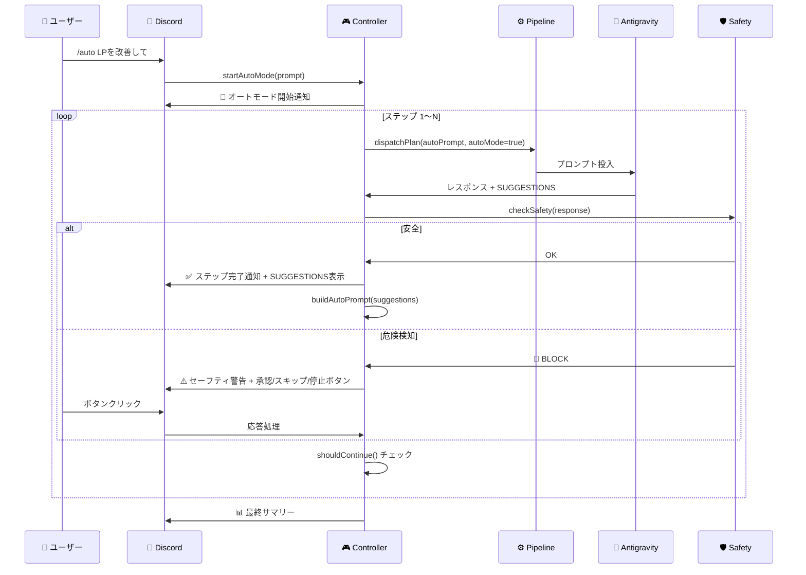

# 🤖 AntiCrow オートモード設計書（最終版）

> **バージョン**: 1.0 (2026-03-07)
> **ステータス**: 設計確定 — Phase 1 実装準備完了
> **機能分類**: Pro 限定

---

## 1. 概要

### オートモードとは

**「🤖 エージェントに任せる」ボタンの連続実行版**。

- ユーザーが `/auto LPをリニューアルして` とコマンドを投入
- AIが1ステップ完了するごとに、自律的に次のアクションを判断して自動実行
- 事前に設定した最大ステップ数（デフォルト: 5）またはAIが「完了」と判断した時点でループ終了
- 各ステップのDiscord通知でユーザーは進捗を監視可能

### `/suggest` コマンドとの違い

| 項目 | `/suggest` | オートモード |
|---|---|---|
| 目的 | プロジェクト分析→提案生成 | 自律的な連続タスク実行 |
| トリガー | ユーザーが手動で実行 | `/auto` コマンドで開始 |
| 実行回数 | 1回（提案を表示するだけ） | N回ループ（自動実行） |
| SUGGESTIONSとの関係 | 独立（SUGGESTIONSは使わない） | 参考情報としてプロンプトに含める |

---

## 2. システムフロー

```mermaid
flowchart TD
    User["👤 ユーザー"]
    Discord["💬 Discord"]
    AntiCrow["🦅 Anti-Crow"]
    Controller["🎮 autoModeController"]
    Pipeline["⚙️ planPipeline"]
    Antigravity["🚀 Antigravity"]
    Safety["🛡️ セーフティガード"]

    User -->|"/auto LPを改善して"| Discord
    Discord -->|コマンド受信| AntiCrow
    AntiCrow -->|オートモード開始| Controller
    Controller -->|buildAutoPrompt()| Pipeline
    Pipeline -->|プロンプト投入| Antigravity
    Antigravity -->|レスポンス + SUGGESTIONS| Controller
    Controller -->|checkSafety()| Safety
    Safety -->|OK| Controller
    Safety -->|🚨 危険検知| Discord
    Discord -->|承認/スキップ/停止| Controller
    Controller -->|ループ続行?| Controller
    Controller -->|完了| Discord
    Discord -->|サマリー通知| User
```

### ループの詳細フロー

```
ステップ1: 初期プロンプト投入（ユーザー指示 + AUTO_PROMPT）
    ↓
Antigravity 実行 → レスポンス + SUGGESTIONS 3つ
    ↓
autoModeController が受信
    ↓
checkSafety(response) — レイヤーA安全チェック
    ↓ (OK)
Discord にステップ完了通知（SUGGESTIONSを参考情報として表示）
    ↓
buildAutoPrompt(channelId) — SUGGESTIONSをプロンプトに含めて投入
    ↓
ステップ2: AIが自律判断 → 実行 → レスポンス + SUGGESTIONS
    ↓
（繰り返し... 最大N回 or AIが完了判断）
    ↓
終了: Discord にサマリー通知
```

---

## 3. コンポーネント責務

### 3.1 `autoModeController.ts`（新規）

**オートモードの心臓部。**

```typescript
// ===== 型定義 =====

interface AutoModeState {
    active: boolean;
    channelId: string;
    wsKey: string;
    currentStep: number;
    maxSteps: number;
    maxDuration: number;       // ミリ秒
    startedAt: number;         // Date.now()
    config: AutoModeConfig;
    history: StepResult[];
    paused: boolean;           // セーフティ一時停止
}

interface AutoModeConfig {
    selectionMode: 'auto-delegate' | 'first' | 'ai-select';
    confirmMode: 'auto' | 'semi' | 'manual';
    maxSteps: number;          // デフォルト: 5
    maxDuration: number;       // デフォルト: 30分 (1800000ms)
}

interface StepResult {
    step: number;
    prompt: string;
    response: string;
    suggestions: SuggestionItem[];
    duration: number;          // ミリ秒
    safetyResult: SafetyCheckResult;
}

interface SafetyCheckResult {
    safe: boolean;
    reason?: string;
    severity?: 'block' | 'warn';
    pattern?: string;
}
```

**主要メソッド:**

| メソッド | 責務 |
|---|---|
| `startAutoMode()` | ループ開始。autoApprove有効化。Discord通知。 |
| `onStepComplete()` | レスポンス受信→安全チェック→次ステップ投入 |
| `buildAutoPrompt()` | `getAllSuggestions()` + `autoPromptPrefix` テンプレートでプロンプト構築 |
| `checkSafety()` | DANGEROUS_PATTERNS で事前チェック |
| `shouldContinue()` | ループ継続判定（ステップ数/時間/完了フラグ） |
| `stopAutoMode()` | ループ停止。状態リセット。Discord通知。 |
| `pauseForSafety()` | 危険検知時の一時停止。Discord承認待ち。 |

### 3.2 `executorResponseHandler.ts`（修正）

**変更点**: `sendProcessedResponse()` にオートモードコールバックを追加

```typescript
// 既存のsendProcessedResponse()の末尾に追加
if (suggestions.length > 0) {
    // 既存: 提案ボタン送信
    await callbacks.sendSuggestionButtons(suggestions);
    
    // 新規: オートモードコールバック
    if (callbacks.onAutoModeComplete) {
        callbacks.onAutoModeComplete(suggestions, cleanContent);
    }
}
```

### 3.3 `planPipeline.ts`（修正）

**変更点**: `dispatchPlan()` に `autoMode` パラメータ追加

```typescript
export async function dispatchPlan(
    ctx: BridgeContext,
    plan: Plan,
    channel: TextChannel,
    activeCdp: CdpBridge,
    wsNameFromCategory: string | undefined,
    guild: typeof import('discord.js').Guild.prototype | null,
    isTeamMode = false,
    autoMode = false,    // ★ 追加
): Promise<void> {
    // autoMode の場合: 確認ステップをスキップ
    if (autoMode) {
        // 直接実行キューに追加
    }
}
```

### 3.4 `slashHandler.ts`（修正）

**変更点**: `/auto` コマンドハンドラ追加 + セーフティ応答ボタン

```typescript
// /auto コマンド
if (customId === 'auto_start' || message.startsWith('/auto ')) {
    const prompt = message.replace('/auto ', '');
    await autoModeController.startAutoMode(ctx, channelId, prompt);
}

// セーフティ応答ボタン
if (customId === 'safety_approve') { /* 承認 → ループ再開 */ }
if (customId === 'safety_skip')    { /* スキップ → 次ステップへ */ }
if (customId === 'safety_stop')    { /* 停止 → オートモード終了 */ }
```

### 3.5 `cdpUI.ts`（修正）

**変更点**: `shouldBlockAutoApprove()` をレイヤーCとして追加

```typescript
// autoApprove() 内に追加
function shouldBlockAutoApprove(dialogText: string): SafetyCheckResult {
    for (const { pattern, reason, severity } of DANGEROUS_PATTERNS) {
        if (pattern.test(dialogText)) {
            return { safe: false, reason, severity, pattern: pattern.source };
        }
    }
    return { safe: true };
}
```

### 3.6 `licenseGate.ts`（修正）

**変更点**: autoMode を Pro 限定機能として追加

### 3.7 `i18n/(ja|en).ts`（修正）

**変更点**: オートモード + セーフティ関連の翻訳追加

---

## 4. データフロー



---

## 5. セーフティガード

### 2段防御アーキテクチャ

| レイヤー | 場所 | タイミング | 対象 |
|---|---|---|---|
| **A: プリフライトチェック** | `autoModeController.ts` | AIレスポンス受信直後 | AIの提案テキスト全体 |
| **C: autoApproveブラックリスト** | `cdpUI.ts` | ツール実行の承認ダイアログ表示時 | 確認ダイアログのテキスト |

### DANGEROUS_PATTERNS 全パターン一覧

#### ファイルシステム破壊（3パターン）

| パターン | 検知対象 | severity |
|---|---|---|
| `rm\s+-rf\|rmdir\s+/s` | 再帰的ファイル削除 | 🔴 block |
| `>\s*/dev/null\|truncate` | ファイル内容破壊 | 🔴 block |
| `format\s+[a-z]:\|diskpart` | ディスクフォーマット | 🔴 block |

#### Git破壊操作（3パターン）

| パターン | 検知対象 | severity |
|---|---|---|
| `git\s+reset\s+--hard` | コミット履歴の強制リセット | 🔴 block |
| `git\s+push\s+--force\|git\s+push\s+-f` | 強制プッシュ | 🟡 warn |
| `git\s+clean\s+-fd` | 未追跡ファイルの強制削除 | 🟡 warn |

#### DB破壊（2パターン）

| パターン | 検知対象 | severity |
|---|---|---|
| `DROP\s+(TABLE\|DATABASE)` | テーブル/DB削除 | 🔴 block |
| `TRUNCATE\s+TABLE` | テーブル全件削除 | 🔴 block |

#### 暗号資産保護（10パターン）

| パターン | 検知対象 | severity |
|---|---|---|
| `private[_\s]?key\|secret[_\s]?key` | 秘密鍵へのアクセス | 🔴 block |
| `seed[_\s]?phrase\|mnemonic\|recovery[_\s]?phrase` | シードフレーズへのアクセス | 🔴 block |
| `keypair.*export\|export.*keypair` | キーペアのエクスポート | 🔴 block |
| `solana.*keypair\|phantom.*seed\|metamask.*seed\|backpack.*seed` | ウォレット固有の秘密情報 | 🔴 block |
| `\.json.*keypair\|id\.json\|devnet\.json` | Solanaキーペアファイル | 🔴 block |
| `transfer.*all\|drain.*wallet\|sweep.*funds` | 資金ドレイン | 🔴 block |
| `withdraw.*max\|withdraw.*all\|empty.*wallet` | 全額出金 | 🔴 block |
| `curl.*secret\|fetch.*private_key\|post.*mnemonic` | 秘密情報の外部送信 | 🔴 block |
| `\.env.*(cat\|type\|echo\|print\|log)` | .envファイルの内容出力 | 🔴 block |
| `api[_\s]?key.*(curl\|fetch\|post\|send)` | APIキーの外部送信 | 🔴 block |

#### プロンプトインジェクション（3パターン）

| パターン | 検知対象 | severity |
|---|---|---|
| `ignore\s+previous\|disregard\s+instructions` | 指示無視攻撃 | 🟡 warn |
| `system\s+prompt\|you\s+are\s+now` | システムプロンプト上書き | 🟡 warn |
| `eval\|exec\|Function\(` | 動的コード実行 | 🔴 block |

**合計: 21パターン**

### 検知時のフロー

```
DANGEROUS_PATTERNS マッチ
    ↓
severity === 'block'?
    ├── YES → オートモード一時停止 → Discord通知（承認/スキップ/停止）
    └── NO (warn) → Discord警告表示 → ループ続行
```

---

## 6. Discord UI設計

### 6.1 オートモード開始通知

```
🚀 オートモード開始
━━━━━━━━━━━━━━━━━━━━

📝 タスク: LPをリニューアルして
⚙️ 設定: 最大5ステップ / 30分
🔒 セーフティガード: 有効

[❌ 停止]
```

### 6.2 ステップ完了通知

```
✅ ステップ 2/5 完了 (42秒)
━━━━━━━━━━━━━━━━━━━━

📄 HeroセクションのレスポンシブCSS修正

💡 AIが参照した提案:
  1. 💡 テストを追加
  2. 🔧 アニメーション調整
  3. 🚀 デプロイ

⏱️ 経過: 3分22秒 / 30分
████████░░ 40%

[❌ 停止]
```

### 6.3 セーフティ警告通知

```
🚨 セーフティガード発動
━━━━━━━━━━━━━━━━━━━━

⚠️ 危険なアクションを検知しました

🔍 検知内容: 秘密鍵へのアクセス
📝 パターン: private_key
📄 該当テキスト: "const pk = process.env.PRIVATE_KEY"

⏸️ オートモードを一時停止しました

[✅ 承認] [⏭️ スキップ] [🛑 停止]
```

### 6.4 最終完了サマリー

```
📊 オートモード完了
━━━━━━━━━━━━━━━━━━━━

✅ 完了ステップ: 4/5
⏱️ 合計時間: 8分34秒
🛡️ セーフティ発動: 0回

📋 実行履歴:
  1. ✅ Hero セクション改善 (1m12s)
  2. ✅ レスポンシブCSS調整 (42s)
  3. ✅ アニメーション追加 (2m05s)
  4. ✅ ビルド検証 (28s)

🎉 AIが全タスク完了と判断しました
```

---

## 7. 設定項目

```typescript
interface AutoModeConfig {
    /** 最大ステップ数（デフォルト: 5） */
    maxSteps: number;
    
    /** 最大実行時間（デフォルト: 30分 = 1800000ms） */
    maxDuration: number;
    
    /** 確認モード */
    confirmMode: 'auto' | 'semi' | 'manual';
    // auto: 全ステップ自動実行（Phase 1 デフォルト）
    // semi: 偶数ステップで確認
    // manual: 毎ステップ確認
    
    /** 選択方式 */
    selectionMode: 'auto-delegate' | 'first' | 'ai-select';
    // auto-delegate: AUTO_PROMPT + SUGGESTIONSコンテキスト（デフォルト）
    // first: SUGGESTIONS[0] を機械的に選択
    // ai-select: 全SUGGESTIONSを見てAIに選ばせる
}
```

| 設定 | デフォルト | 範囲 | 説明 |
|---|---|---|---|
| maxSteps | 5 | 1-20 | ループの最大反復回数 |
| maxDuration | 30分 | 5分-2時間 | タイムアウト |
| confirmMode | auto | auto/semi/manual | ステップ間の確認 |
| selectionMode | auto-delegate | 3種 | 次のアクション決定方法 |

---

## 8. エッジケース

### 8.1 エラー時のリカバリー

| エラー種別 | 対応 |
|---|---|
| AI実行エラー（Antigravity 500等） | 1回リトライ → 失敗時はループ停止 + Discord通知 |
| IPC タイムアウト | ループ停止 + Discord通知 + staleリカバリー委任 |
| Discord API エラー | ログ記録 + ループは続行（通知なし） |

### 8.2 無限ループ防止

3つのガードで防止:

1. **maxSteps**: ステップ数上限（デフォルト: 5）
2. **maxDuration**: 時間上限（デフォルト: 30分）
3. **類似検知**: 直前2ステップのレスポンスが90%以上類似していたら停止

### 8.3 VSIX 再起動時

- **オートモード状態は永続化しない**
- 再起動後はオートモードが自動終了
- 理由: ステートの永続化は複雑度が高く、Phase 1 では不要
- ユーザーは `/auto` で再開可能

### 8.4 autoApprove 未有効時

- オートモード開始時に自動で有効化
- オートモード終了時に元の状態に戻す
- autoApprove が手動で無効化された場合はオートモードも停止

---

## 9. 実装フェーズ

### Phase 1（最小MVP）

| 項目 | 内容 |
|---|---|
| selectionMode | `auto-delegate` のみ |
| confirmMode | `auto` のみ |
| セーフティガード | 全21パターン有効 |
| Discord UI | 全通知タイプ実装 |
| 対象 | Pro ユーザー限定 |

**実装ファイル:**

1. `src/autoModeController.ts`（新規 〜300行）
2. `src/executorResponseHandler.ts`（+20行）
3. `src/planPipeline.ts`（+10行）
4. `src/slashHandler.ts`（+40行）
5. `src/cdpUI.ts`（+30行）
6. `src/licensing/licenseGate.ts`（+5行）
7. `src/i18n/ja.ts`（+30行）
8. `src/i18n/en.ts`（+30行）

**推定工数**: 合計 〜465行の追加・修正

### Phase 2（追加機能）

- `ai-select` 選択方式
- `semi` / `manual` 確認モード
- ステップ間の差分サマリー自動生成
- ユーザー設定の永続化

### Phase 3（応用）

- チームモード × オートモード連携
- `/suggest` をオートモードの入力源として利用
- オートモード実行履歴のログ保存

---

## 調査した既存コード

| ファイル | 確認箇所 | 設計への影響 |
|---|---|---|
| `slashButtonMisc.ts` | L136-158: suggest_auto ハンドラ | `buildAutoPrompt()` のロジック源泉 |
| `suggestionButtons.ts` | AUTO_PROMPT, getAllSuggestions() | オートモードで再利用する定数・関数 |
| `executorResponseHandler.ts` | sendProcessedResponse() | onAutoModeComplete コールバック挿入点 |
| `planPipeline.ts` | dispatchPlan() | autoMode パラメータ追加 |
| `cdpUI.ts` | autoApprove(), PERMISSION_SCRIPT | shouldBlockAutoApprove() 追加先 |
| `licenseGate.ts` | ProFeature enum | autoMode 追加先 |
| `i18n/ja.ts` | autoPromptPrefix テンプレート | オートモードで同じテンプレート再利用 |
